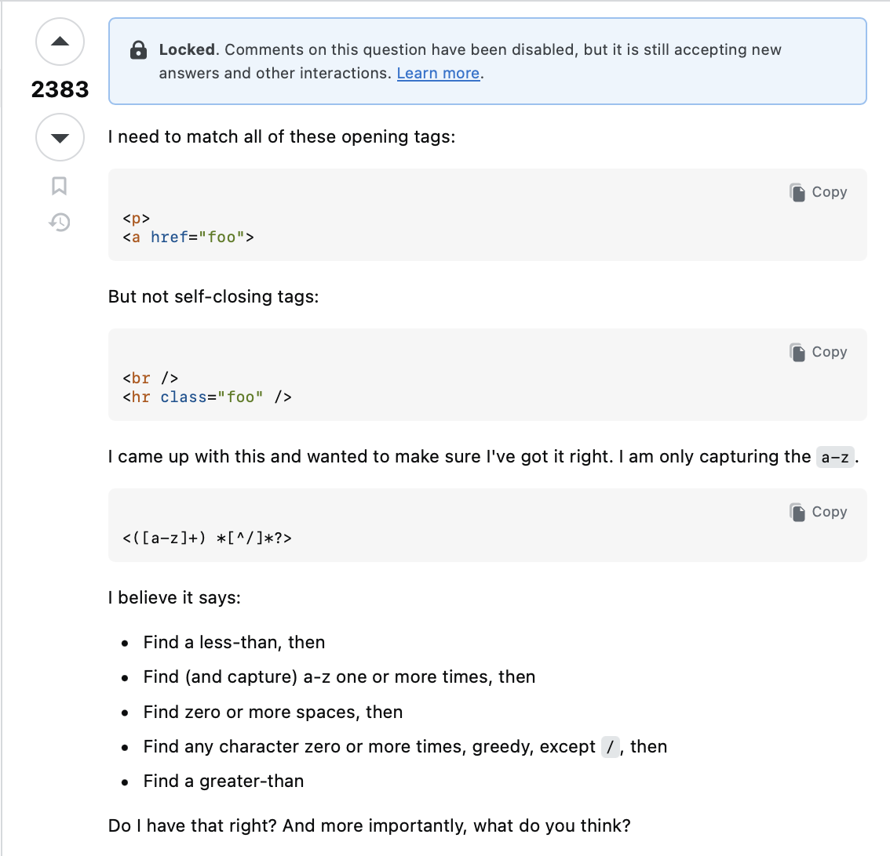
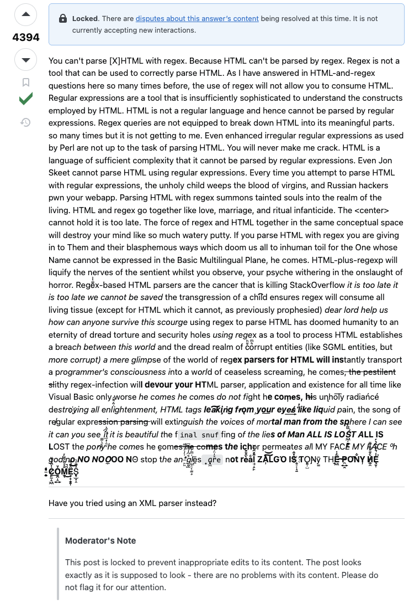

## SQL codebases accumulate structural debt

Two devs writing the same query give you two different queries:

:::: {.columns}
::: {.column width="50%"}
```sql
WITH x AS (SELECT a FROM t)
SELECT * FROM x
```
:::
::: {.column width="50%"}
```sql
SELECT * FROM (SELECT a FROM t)
```
:::
::::

<hr>

:::: {.columns}
::: {.column width="50%"}
```sql
SELECT CASE WHEN x IS NULL THEN 0 ELSE x END FROM t
```
:::
::: {.column width="50%"}
```sql
SELECT COALESCE(x, 0) FROM t
```
:::
::::

<hr>

:::: {.columns}
::: {.column width="50%"}
```sql
WITH r AS (
  SELECT *, ROW_NUMBER() OVER (...) AS rn FROM t
)
SELECT * FROM r WHERE rn = 1
```
:::
::: {.column width="50%"}
```sql
SELECT *
FROM t
QUALIFY ROW_NUMBER() OVER (...) = 1
```
:::
::::

<hr>

:::: {.columns}
::: {.column width="50%"}
```sql
SELECT SUM(x), AVG(y) FROM t
```
:::
::: {.column width="50%"}
```sql
SELECT SUM(x) AS total_x, AVG(y) AS mean_y FROM t
```
:::
::::

<hr>

:::: {.columns}
::: {.column width="50%"}
```sql
SELECT a / b FROM t
```
:::
::: {.column width="50%"}
```sql
SELECT a / NULLIF(b, 0) FROM t
```
:::
::::

How can SQL code quality and correctness be maintained at scale?

## Initial example

A common data pipeline (anti-)pattern:

```sql
-- Source
CREATE TEMP TABLE a AS (...);

-- Intermediary tables
CREATE TEMP TABLE b AS (SELECT ... FROM a ...);
CREATE TEMP TABLE c AS (SELECT ... FROM a ...);

-- Output
CREATE TEMP TABLE d AS (SELECT ... FROM b JOIN c ...);

-- Redundant orphan table
CREATE TEMP TABLE e AS (...);
```

How do we draw the tables' dependency graph?

## What is regex?

A mini-language for matching patterns in text.

| Pattern    | Meaning                          |
|------------|----------------------------------|
| `\d` `\w` `\s` | digit, word char, whitespace |
| `+` `*` `?`    | one or more, zero or more, optional |
| `[abc]`    | any of these chars               |
| `(...)`    | capture group                    |
| `(?:...)`  | non-capturing group              |
| `\b`       | word boundary                    |

```{python}
#| echo: true
import re
re.findall(r"\d+", "order 42 cost $1299")
```

```{python}
#| echo: true
re.findall(r"\b(?:FROM|JOIN)\s+(\w+)", "SELECT * FROM a JOIN b ON ...")
```

## Dependency graph with regex

:::: {.columns}
::: {.column width="50%"}
**Code**

```{python}
#| echo: true
import re

# Word after "CREATE TEMP TABLE"
target_re = re.compile(r"CREATE TEMP TABLE (\w+)")

# Word after "FROM" or "JOIN"
source_re = re.compile(r"\b(?:FROM|JOIN)\s+(\w+)")

sql = """
CREATE TEMP TABLE a AS (...);
CREATE TEMP TABLE b AS (SELECT ... FROM a ...);
CREATE TEMP TABLE c AS (SELECT ... FROM a ...);
CREATE TEMP TABLE d AS (SELECT ... FROM b JOIN c ...);
CREATE TEMP TABLE e AS (...);
"""

edges, targets = [], []
for stmt in sql.split(";"):
    tgt = target_re.search(stmt)
    if not tgt: continue
    targets.append(tgt.group(1))
    for src in source_re.findall(stmt):
        edges.append((src, tgt.group(1)))
```
:::
::: {.column width="50%"}
**Output**

```{python}
#| echo: false
#| output: asis
print("```{mermaid}")
print("graph LR")
for s, t in edges:
    print(f"  {s} --> {t}")
referenced = {x for e in edges for x in e}
for n in targets:
    if n not in referenced:
        print(f"  {n}")
print("```")
```
:::
::::

## Pitfalls

- **Blind to structure**: Can't tell a real `FROM` from one inside a comment or string.
- **Fragile to formatting**: Newlines, aliases, quoted identifiers all need new patterns.
- **Read-only**: You can only match, not transform.
- **Unreadable**: A "robust" `FROM` pattern looks like this:

```python
r'\bFROM\s+(?:(?:"[^"]+"|`[^`]+`|\w+)\.)?("[^"]+"|`[^`]+`|\w+)(?:\s+(?:AS\s+)?(\w+))?'
```

## Eldritch horrors lurk beneath

:::: {.columns .fill-images}
::: {.column width="50%"}
**Question**


:::
::: {.column width="50%"}
**Answer**


:::
::::

## What is an AST?

An Abstract Syntax Tree that represents the *structure* of code (operators, arguments, _etc._).

:::: {.columns}
::: {.column width="50%"}
**Code**

```python
x = (a + b) / 2
```
:::
::: {.column width="50%"}
**AST**

```{mermaid}
graph TD
  E["="] --> X[x]
  E --> D["/"]
  D --> A["+"]
  D --> N[2]
  A --> AA[a]
  A --> AB[b]
```
:::
::::

A parser takes code as input and outputs the tree.

## Parsing with sqloxide

:::: {.columns}
::: {.column width="45%"}
**Code**

```{python}
#| echo: true
#| eval: false
import sqloxide, json

sql = """
WITH t AS (SELECT x FROM y)
SELECT
    a, SUM(b)
FROM t
WHERE c > 0
GROUP BY a
"""

ast = sqloxide.parse_sql(sql, dialect="postgres")
print(json.dumps(ast, indent=2))
```
:::
::: {.column width="55%" .scroll-output}
**Output**

```{python}
#| echo: false
from IPython.display import Markdown
import sqloxide, json

sql = """
WITH t AS (SELECT x FROM y)
SELECT
    a, SUM(b)
FROM t
WHERE c > 0
GROUP BY a
"""

ast = sqloxide.parse_sql(sql, dialect="postgres")
Markdown(f"```json\n{json.dumps(ast, indent=2)}\n```")
```
:::
::::

## Dependency graph with ASTs

:::: {.columns}
::: {.column width="50%"}
**Code**

```{python}
#| echo: true
import sqloxide
parse = lambda s: sqloxide.parse_sql(s, dialect="postgres")

def find_tables(node):
    if isinstance(node, dict):
        if "Table" in node:
            yield node["Table"]["name"][0]["Identifier"]["value"]
        for v in node.values(): yield from find_tables(v)
    elif isinstance(node, list):
        for x in node: yield from find_tables(x)

sql = """
CREATE TEMP TABLE a AS (SELECT 1 AS x);
CREATE TEMP TABLE b AS (SELECT * FROM a);
CREATE TEMP TABLE c AS (SELECT * FROM a);
CREATE TEMP TABLE d AS (SELECT * FROM b JOIN c ON b.x = c.x);
CREATE TEMP TABLE e AS (SELECT 1 AS y);
"""

edges, targets = [], []
for stmt in parse(sql):
    ct = stmt.get("CreateTable")
    if not ct: continue
    tgt = ct["name"][0]["Identifier"]["value"]
    targets.append(tgt)
    for src in find_tables(ct["query"]):
        edges.append((src, tgt))
```
:::
::: {.column width="50%"}
**Output**

```{python}
#| echo: false
#| output: asis
print("```{mermaid}")
print("graph LR")
for s, t in edges:
    print(f"  {s} --> {t}")
referenced = {x for e in edges for x in e}
for n in targets:
    if n not in referenced:
        print(f"  {n}")
print("```")
```
:::
::::

## Subquery depth

:::: {.columns}
::: {.column width="50%"}
**Function**

```{python}
#| echo: true
def subquery_depth(node, depth=0):
    if isinstance(node, dict):
        children = node.values()
        depth += "Select" in node
    elif isinstance(node, list):
        children = node
    else:
        return depth
    return max((subquery_depth(c, depth) for c in children),
               default=depth)
```
:::
::: {.column width="50%"}
**Examples**

```{python}
#| echo: true
import sqloxide
parse = lambda s: sqloxide.parse_sql(s, dialect="postgres")

subquery_depth(parse("""
SELECT a FROM (SELECT b FROM c)
"""))
```

```{python}
#| echo: true
subquery_depth(parse("""
SELECT a
FROM (
    SELECT b FROM (
        SELECT c FROM d
    )
)
"""))
```
:::
::::

## Auto-aliasing aggregates

```{python}
#| echo: false
strip = lambda x: ({k: strip(v) for k, v in x.items() if k != "span"}
                   if isinstance(x, dict)
                   else [strip(v) for v in x] if isinstance(x, list) else x)
```

:::: {.columns}
::: {.column width="50%"}
**`SELECT SUM(a) FROM b` parses to**

```{python}
#| echo: true
strip(parse("SELECT SUM(a) FROM b")[0]["Query"]["body"][
    "Select"]["projection"][0])
```
:::
::: {.column width="50%"}
**`SELECT SUM(a) AS total_a FROM b` parses to**

```{python}
#| echo: true
strip(parse("SELECT SUM(a) AS total_a FROM b")[0]["Query"]["body"][
    "Select"]["projection"][0])
```
:::
::::

## Auto-aliasing aggregates

:::: {.columns}
::: {.column width="50%"}
**Function**

```{python}
#| echo: true
import sqloxide

ALIAS_MAP = {"SUM": "total", "AVG": "mean",
             "COUNT": "n", "MIN": "min", "MAX": "max"}

_ALIAS = parse("SELECT x AS y")[0]["Query"]["body"][
    "Select"]["projection"][0]["ExprWithAlias"]["alias"]

def auto_alias(node):
    if isinstance(node, dict):
        ue = node.get("UnnamedExpr")
        if ue and "Function" in ue:
            f = ue["Function"]
            name = f["name"][0]["Identifier"]["value"].upper()
            if name in ALIAS_MAP:
                arg = (f["args"]["List"]["args"][0]
                        ["Unnamed"]["Expr"]["Identifier"]["value"])
                alias = {**_ALIAS, "value": f"{ALIAS_MAP[name]}_{arg}"}
                return {"ExprWithAlias": {"expr": ue, "alias": alias}}
        return {k: auto_alias(v) for k, v in node.items()}
    if isinstance(node, list):
        return [auto_alias(x) for x in node]
    return node
```
:::
::: {.column width="50%"}
**Example**

```{python}
#| echo: true
ast = parse("""
SELECT
    SUM(revenue), AVG(price), COUNT(orders)
FROM t
""")

print(sqloxide.restore_ast(auto_alias(ast))[0])
```
:::
::::

## Wrapping denominators in `NULLIF`

:::: {.columns}
::: {.column width="50%"}
**`NULLIF(x, 0)` template**

```{python}
#| echo: true
import copy

_NULLIF = parse("SELECT NULLIF(x, 0)")[0]["Query"]["body"][
    "Select"]["projection"][0]["UnnamedExpr"]

strip = lambda x: ({k: strip(v) for k, v in x.items() if k != "span"}
                   if isinstance(x, dict)
                   else [strip(v) for v in x] if isinstance(x, list) else x)
strip(_NULLIF)
```
:::
::: {.column width="50%"}
**`SELECT x / y FROM a` parses to**

```{python}
#| echo: true
strip(parse("SELECT x / y FROM a")[0]["Query"]["body"][
    "Select"]["projection"][0])
```
:::
::::

## Wrapping denominators in `NULLIF`

:::: {.columns}
::: {.column width="50%"}
**Function**

```{python}
#| echo: true
def wrap_denominators(node):
    if isinstance(node, dict):
        new = {k: wrap_denominators(v) for k, v in node.items()}
        if "BinaryOp" in new and new["BinaryOp"]["op"] == "Divide":
            wrapper = copy.deepcopy(_NULLIF)
            (wrapper["Function"]["args"]["List"]["args"][0]
                    ["Unnamed"]["Expr"]) = new["BinaryOp"]["right"]
            new["BinaryOp"] = {**new["BinaryOp"], "right": wrapper}
        return new
    if isinstance(node, list):
        return [wrap_denominators(x) for x in node]
    return node
```
:::
::: {.column width="50%"}
**Example**

```{python}
#| echo: true
ast = parse("""
SELECT
    a / b,
    x / (y - z)
FROM t
""")

print(sqloxide.restore_ast(wrap_denominators(ast))[0])
```
:::
::::

## Finding unused CTEs

:::: {.columns}
::: {.column width="50%"}
**Function**

```{python}
#| echo: true
def unused_ctes(ast):
    ctes, refs = [], set()

    def walk(node, defining=None):
        if isinstance(node, dict):
            if "cte_tables" in node:
                for cte in node["cte_tables"]:
                    name = cte["alias"]["name"]["value"]
                    ctes.append(name)
                    walk(cte["query"], defining=name)
                return
            if "Table" in node:
                ref = node["Table"]["name"][0]["Identifier"]["value"]
                if ref != defining:
                    refs.add(ref)
            for v in node.values(): walk(v, defining)
        elif isinstance(node, list):
            for x in node: walk(x, defining)

    walk(ast)
    return [c for c in ctes if c not in refs]
```
:::
::: {.column width="50%"}
**Example**

```{python}
#| echo: true
unused_ctes(parse("""
    WITH
      a AS (SELECT * FROM t),
      b AS (SELECT * FROM a),
      c AS (SELECT * FROM t)
    SELECT * FROM b
"""))
```
:::
::::

## FAQs

- **Why not use LLMs?**
    - Deterministic > probabilistic
    - Token costs!
    - LLMs tend to hallucinate often with SQL
    - The middle ground is to use LLMs to write the tree functions
- **Is Python the best suited language for this?**
    - Metaprogramming is best served by functional, homoiconic languages (Scheme, Clojure)

::: footer
[github.com/mxchelsemaan/pydata_ldn2026_querying_queries_sql_metaprogramming_python](https://github.com/mxchelsemaan/pydata_ldn2026_querying_queries_sql_metaprogramming_python)
:::
